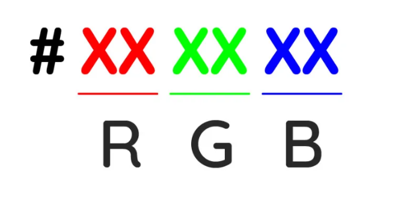

<!-- @format -->

# CSS

毛哥 EM

---

## CSS 簡介

主要功能:美觀網站

 <!-- .element: height="400px" -->

---

## 範例 <!-- .element: style="color:red;" -->

```css
h1 {
    color: red;
}
```

---

## 寫在哪裡?

-   在 HTML 建立 `<style>` 裡面 (通常放在 `<head>` 裡面)
-   創一個 CSS 檔案，並連結到 HTML(link)

```html
<link rel="stylesheet" type="text/css" href="style.css" />
```

---

```html" data-line-numbers="3,12|7-11|14
<!DOCTYPE html>
<html lang="en">
<head>
    <meta charset="UTF-8">
    <meta name="viewport" content="width=device-width, initial-scale=1.0">
    <title>Document</title>
    <style>
        h1{
            color: red;
        }
    </style>
</head>
<body>
    <h1>標題</h1>
</body>
</html>
```

---

## 一個 CSS 宣告包含

-   selector: 選擇器 (對象)
-   declaration: 宣告
-   property: 屬性 (要改的東西)
-   value: 屬性值

```css
h1 {
    color: red;
}
```

---

## 選取器

1. `.` - class 選擇器
2. `#` - id 選擇器
3. `*` - 全部選擇器

---

## 文字

<div style="display:flex;">
<div style="font-size:1.5rem;flex:1;">

-   `color`:顏色
-   `font-size`:字體大小
-   `letter-spacing`:字距
-   `line-height`:行高
-   `font-weight`:字體粗細
-   `text-decoration`: 文字裝飾
-   `font-style`:字型
-   `opacity`:透明度
-   `text-align`:文字位置
-   `font-family`:字體

</div>
<div style="flex:1;">

```css
color: #fff;
font-size: 10px;
letter-spacing: 2;
line-height: 20px;
font-weight: 500;
text-decoration: none;
font-style: italic;
opacity: 0.5;
text-align: left;
font-family: 微軟正黑體;
```

</div>
</div>

---

## 文字粗細 font-weight

### 關鍵字

```css" data-line-numbers="|1,2
font-weight: normal; /* 正常 */
font-weight: bold; /* 粗 */
font-weight: lighter; /* 細一點 */
font-weight: bolder; /* 粗一點 */
```

### 絕對的數值

```css data-line-numbers="|2,3
font-weight: 100;
font-weight: 400; /* 正常 */
font-weight: 700; /* 粗體 */
font-weight: 900;
```

---

## text-decoration

常用於消除[超連結]()的藍色底線

```css" data-line-numbers="|3
text-decoration: underline; /* 底線 */
text-decoration: overline red; /* 劃過的線 */
text-decoration: none; /* 不要 */
text-decoration-color: #ff00ff; /* 線顏色 */
```

---

## 背景圖片

```css
background-image: url(./image/cloud.png); /* 背景圖片 */
background-repeat: no-repeat; /* 背景重複 */
background-size: cover; /* 不管有沒有全部進去，反正就是塞滿 */
background-size: contain; /* 全部塞進去 */
```

```css
background-position: top left;
background-position: 20% 40%; /*從左上開始算*/
```

---

<div style="display: flex;">
<div style="flex:1;font-size:1rem">

`background-size: contain;`

<video style="width:100%;height:300px;border:2px solid #FFF" data-autoplay loop src="/slides/CSS/long.webp"></video></div>

<div style="flex:1;font-size:1rem">

`background-size: cover;`

<video style="width:100%;height:300px;border:2px solid #FFF;object-fit: cover;object-position: top;" data-autoplay loop src="/slides/CSS/long.webp"></video></div>
</div>

---

## 顏色表示法

-   顏色名稱 - `red`
-   RGB/RGBA - `rgb(255,0,0)`, `rgba(255,0,0,0.5)`
-   HEX - `#ff0000`
-   HSL - `hsl(0,100%,50%)`

---

### RGB/RGBA

<span style=color:red>R</span>,<span style=color:green>G</span>,<span style=color:blue>R</span> 參數範圍為 0 ~ 255  
alpha 不透明介於 0 ~ 1 之間

```css
範例: 半透明紫色 rgba(160, 32, 240, 0.5);
```

---

### HEX

十六進位（hexadecimal



*   黑色:#000000
*   白色:#ffffff

---

### HSL

-   H : hue 色相 (0 是紅色 120 是綠色 240 是藍色)
-   S : saturation 飽和度
-   L : lightness 明度
```css
color: hsl(0, 100%, 50%);
```

---


---

## 單位

-   px
-   em
-   rem
-   vw/vh
-   %

---

### px

相對顯示器的解析度，為絕對單位(pixel)


---

### em

相對父元素的 m 寬度(預設 16px)


---

### rem

相對根元素的 m 寬度(預設 16px)


---

### vw/vh

viewport（視口）寬/長度

---

### %

1. width 跟 height 的%基準是父層
2. line-height 以本身文字行高為基準


---

## box

1. 漸層
2. Padding
3. Grandient

---

### box 是什麼?

html 的每個元素都可被視作為一個盒子，然後可以針對這個盒子去做調整。

---

### box-sizing

```css
box-sizing
```

是設定物件尺寸的計算方式。

1. ```css
   box-sizing: content-box;
   ```

````
(content area)

2. ```css
box-sizing:border-box
````

（content area+padding+border）


---

-   所以在 block 元素中只要設定 `css box-sizing:border-box;` 就不用另外再計算 padding、border 的寬度。
-   假設 width:300px, padding 就算加了 20px, border 加了 4px，寬度依舊是 300px。


---

### Padding

padding 的用途是設定物件邊框(border) 內與資料之間的留白空間，常見的翻譯是稱之為「內距」，讓你的資料不致於貼著邊框線。

1. **注意!** Padding 預設會增加物件的可見尺寸!
2. 若你對該物件設定了 padding 之後，padding 的空間則是會添加到 width 之外，所以物件的尺寸就變成了 「width + padding 」

```css
/*四個值，個別指定*/
padding: 上 右 下 左;

/*三個值，左右採用同一個值，上下則分開指定*/
padding: 上 [右左] 下;

/*二個值，【上下】採用同一值，【左右】採用同一值*/
padding: [上下] [右左];

/*一個值，【上下左右】都使用相同的值*/
padding: [上右下左];
```

---

## 漸層

1. 漸層需要顏色跟角度
2. 可分為**線性漸層**跟**放射漸層**
3. 可以指定每個顏色的比例
4. 可以決定漸層位置跟大小

---

### 線性漸層 linear-gradient

```css
background: linear-gradient(方向, 顏色1 位置, 顏色2 位置);
```

-   角度
    -   如果沒有設定角度，預設從上往下進行漸層。
-   位置
    -   0% 表示起始邊界，100% 表示結束邊界 ( 邊界為填色的區外邊界 )。
    -   如果沒有指定參數，則會自動等比例分配。
    -   如果沒有指定第一個參數，預設 0%。
    -   如果沒有指定最後一個參數，預設 100%。

---

-   顏色位置重疊
    -   如果兩種顏色位置重疊，結果將會直接呈現兩種顏色交界，若前後邊界沒有設定顏色，則會以最靠近該邊界的顏色補滿。

```css
background: linear-gradient(45deg, red 50%, black 50%);
```


---

### 放射漸層 Radial Gradient

```css
background: radial-gradient(
    形狀 範圍 at 中 心位置,
    顏色 色彩位置,
    顏色 色彩位置,
    ...
);
```

1. 圓形

```css
background: radial-gradient(circle at center, 顏色1, 顏色2);
```

2. 橢圓形

```css
background: radial-gradient(ellipse at center, 顏色1, 顏色2);
```


---

## 背景 background

1. background-color: 背景顏色

```css
background-color: FF0000;
background-color: red; /* 背景為紅色 */
```

---

## float 語法

```css
float: 浮動方向;
```

---

### none

```css
float: none;
```


---

### right

```css
float: right;
```


---

### left

```css
float: left;
```


---

```

```
